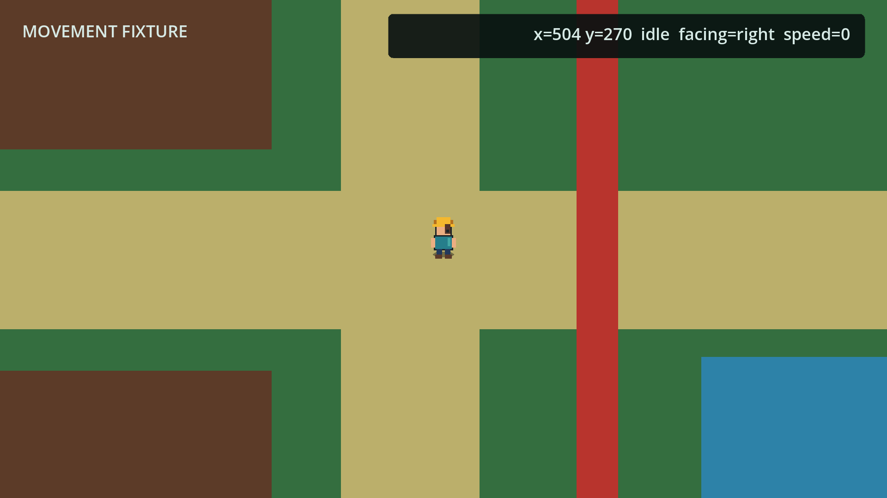

# Godot My Farm

一个使用 **Godot 4.7 标准版**与 **GDScript 2.0** 开发的农场经营游戏项目。

项目以 [Archermmt/my_farm](https://github.com/Archermmt/my_farm) 的玩法、系统职责和交互节奏为核心参考，在不复制 Unity/C# 实现和未授权资源的前提下，用 Godot 重建相同类型的农场经营体验。它同时用于验证 Codex 依据项目文档、测试和 [godot-ai](https://github.com/hi-godot/godot-ai) 完成完整游戏开发的工作流。

> 当前处于核心玩法开发阶段。仓库中的场景和美术仍包含开发夹具与原创占位资源；正式地图、TileMap 和农田网格从 T04 开始接入。



## 当前进度

| 任务 | 内容 | 状态 |
|---|---|---|
| T00 | Godot 工具链、工程骨架、InputMap 和测试入口 | 已完成 |
| T01 | 静态定义、运行时状态、序列化与 catalog 校验 | 已完成 |
| T02 | Autoload、应用启动、全局服务和新游戏状态 | 已完成 |
| T03 | 玩家移动、碰撞、四向动画、相机与输入锁 | 已完成 |
| T04 | 地图、TileMap、农田网格与场景切换 | 下一任务 |

最新验证结果：**44 tests / 250 assertions**，玩家碰撞 fixture、主场景启动和 godot-ai 运行验收均通过。

- [完整任务路线](./docs/TASKS.md)
- [当前开发状态与验收记录](./docs/STATUS.md)
- [游戏设计范围](./docs/00_GAME_DESIGN.md)

## 已实现能力

- 7 个有明确职责的 Autoload：EventBus、DataCatalog、GameState、TimeManager、SceneRouter、SaveManager、AudioManager。
- 12 个物品定义、1 种作物及 4 个成长阶段、3 个采集物、4 张掉落表和 1 份 NPC 日程定义。
- 可 JSON round-trip 的玩家、背包、日历、地图、农田、作物、世界实体和 NPC 状态模型。
- 固定容量背包的堆叠、添加、移除、交换、合并和跨容器交换逻辑。
- 单一 `player.gd` 根控制器：InputMap、跑步/慢走、对角归一化、碰撞、四向朝向、动画状态、输入锁和 Camera2D limits。
- 原生 GDScript 测试运行器、碰撞 fixture、godot-ai 输入序列和运行截图验收链路。

## 技术约束

| 项目 | 选择 |
|---|---|
| 引擎 | Godot 4.7 stable 标准构建 |
| 语言 | GDScript 2.0，不使用 C#/.NET |
| 渲染 | Compatibility / OpenGL |
| 设计分辨率 | 640 x 360，整数缩放与 nearest filtering |
| 状态 | RefCounted/纯 GDScript 状态对象，Dictionary 序列化 |
| 静态数据 | Godot Resource + 显式 catalog |
| 测试 | 项目内原生 headless runner，不依赖第三方测试框架 |
| 编辑器辅助 | godot-ai，仅用于开发和验收，不进入游戏领域逻辑 |

重要架构规则：角色 leaf scene 默认只在根节点使用一个角色脚本。只有出现真实跨角色复用、独立生命周期或可替换实现时，才允许把角色逻辑拆成额外组件。完整规则见 [Godot 与 GDScript 技术规则](./docs/01_TECHNICAL_RULES.md)。

## 架构概览

```text
Main
├── World
│   ├── MapHost              # 当前 farm / field / cabin
│   ├── ActorHost
│   │   └── Player           # 跨地图保持唯一实例
│   └── EffectHost
└── UILayer
    ├── HUD
    ├── InventoryPanel
    └── TransitionOverlay

输入与表现
      ↓
场景领域：Player / FarmSystem / WorldItem / NPC / ScenePort
      ↓
应用服务：SceneRouter / TimeManager / SaveManager / AudioManager
      ↓
状态与定义：GameState / MapState / InventoryState / DataCatalog / *.tres
```

状态、场景和表现分离：GameState 不持有 Node，地图只管理当前空间，持久 Player 由 Main 所有，地图切换由 SceneRouter 以事务方式协调。

详细设计见 [总体技术架构](./docs/02_ARCHITECTURE.md) 和 [参考项目映射](./docs/03_REFERENCE_MAPPING.md)。

## 目录结构

```text
addons/godot_ai/   Godot 编辑器 MCP 插件
assets/            美术、音频、字体及许可清单
data/              Resource catalog 与静态定义
docs/              设计、规则、架构、任务和状态文档
scenes/            Main、Player、地图、世界对象和 UI 场景
scripts/           Autoload、角色、状态、数据与领域脚本
screenshots/       每个任务保留的运行验收证据
tests/             单元、集成和可运行 fixture
tools/             本地资源生成与开发工具
project.godot      Godot 工程入口
```

## 环境要求

- [Godot 4.7 stable](https://godotengine.org/download/archive/4.7-stable/) 标准版。
- macOS、Linux 或 Windows。
- 可选：[uv](https://docs.astral.sh/uv/)；仅在使用 godot-ai 时需要。
- 可选：支持 MCP 的 Codex 或其他开发客户端。

不要使用 Godot .NET/Mono 构建。项目不包含 C# 运行时依赖。

## 获取与运行

```bash
git clone git@github.com:Archermmt/godot_my_farm.git
cd godot_my_farm
godot --editor --path .
```

也可以直接在 Godot Project Manager 中导入仓库根目录的 `project.godot`，然后运行主场景。

当前可用输入：

| 操作 | 输入 |
|---|---|
| 移动 | `W` `A` `S` `D` |
| 慢走 | 按住 `Shift` |
| 主行动 | 鼠标左键，后续任务接入 |
| 次行动 | 鼠标右键，后续任务接入 |

## 测试

首次拉取或资源变化后执行导入：

```bash
godot --headless --path . --import
```

运行全部单元和集成测试：

```bash
godot --headless --path . --script res://tests/test_runner.gd
```

运行玩家物理碰撞 fixture：

```bash
godot --headless --path . \
  --script res://tests/fixtures/player/player_collision_test.gd
```

验证发行主场景可启动并正常退出：

```bash
godot --headless --path . --quit
```

任一任务只有在自动化测试、实际运行、editor/game logs 和视觉截图全部通过后，才能在任务表中标记完成。

## 使用 godot-ai

仓库已包含 `addons/godot_ai`。在 Godot 中打开 **Project > Project Settings > Plugins**，确认 **Godot AI** 已启用；随后在 Godot AI dock 中选择 MCP 客户端并执行 Configure。

godot-ai 用于：

- 读取编辑器状态和场景层级。
- 创建或修改 Godot 节点与资源。
- 启动游戏并读取 editor/game logs。
- 通过 InputMap action 注入稳定的输入序列。
- 获取真实运行 framebuffer 作为视觉验收证据。

完整操作规范见 [godot-ai 开发工作流](./docs/04_GODOT_AI_WORKFLOW.md)。插件本身采用 MIT License，见 [addons/godot_ai/LICENSE](./addons/godot_ai/LICENSE)。

## 文档驱动开发

`docs/` 是后续 Codex 开发的规范入口。开始新任务前按以下顺序读取：

1. [文档入口与优先级](./docs/README.md)
2. [游戏设计](./docs/00_GAME_DESIGN.md)
3. [技术规则](./docs/01_TECHNICAL_RULES.md)
4. [总体架构](./docs/02_ARCHITECTURE.md)
5. [godot-ai 工作流](./docs/04_GODOT_AI_WORKFLOW.md)
6. [测试计划](./docs/05_TEST_PLAN.md)
7. [当前状态](./docs/STATUS.md) 与对应任务卡

任务严格按照 T00-T17 顺序推进。新功能不得跳过依赖，也不得以“代码已写”代替运行验收。

## 参考项目

- [Archermmt/my_farm](https://github.com/Archermmt/my_farm)：玩法、职责划分和交互节奏的核心参考。
- [htdt/godogen](https://github.com/htdt/godogen)：自主开发、持久状态和运行证明方法参考。
- [hi-godot/godot-ai](https://github.com/hi-godot/godot-ai)：Codex 与 Godot 编辑器之间的 MCP 辅助工具。

参考仓库仅用于行为和架构分析。本项目不复制其 C# 源码、Unity Prefab/YAML、GUID 或未确认授权的美术与音频。

## 资源许可

项目生成或引入的可分发资源记录在 [assets/licenses/ASSETS.md](./assets/licenses/ASSETS.md)。当前玩家占位 sprite 为项目本地生成的原创像素资源，并按 CC0-1.0 记录。

正式美术、音频、字体和第三方资源必须在进入发行版本前补齐来源、作者、许可、成本与修改记录。
